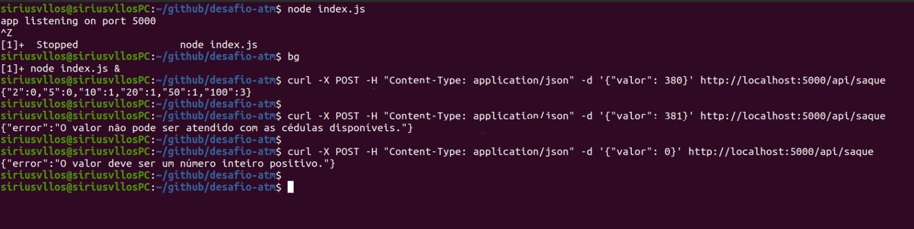

# Desafio ATM para Morada.ai
Essa é minha submissão para o desafio de código do processo seletivo da empresa Morada.ai, um projeto Node.js utilizando a biblioteca Express.

## Como Executar
Para executar o projeto é necessário primeiro ter o Node.js instalado em seu ambiente de desenvolvimento. Depois, siga o passo-a-passo abaixo:
1. Instale as dependências:
    ```bash
    npm install
    ```
2. Execute o servidor:
    ```bash
    node index.js
    ```
Ao executar o servidor, ele vai estar escutando e disponível em `http://localhost:5000`.

## Endpoints
### POST /api/saque
Este endpoint descreve quais e quantas notas são necessárias para formar uma quantia a ser sacada. Para convesar com o endpoint você pode utilizar o comando _curl_:
```bash
curl -X POST -H "Content-Type: application/json" -d '{"valor": 380}' http://localhost:5000/api/saque
```
Você pode substituir o número _380_ no campo _valor_ por qualquer quantia a ser sacada.

## Testes

